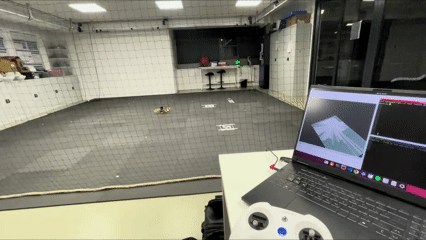
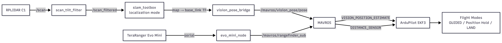
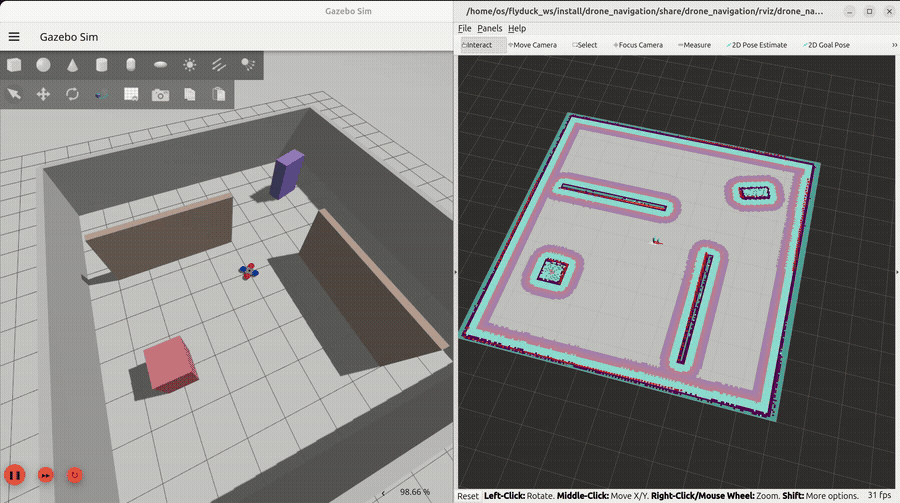
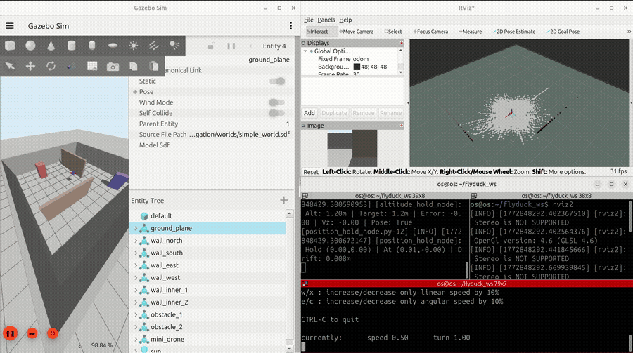
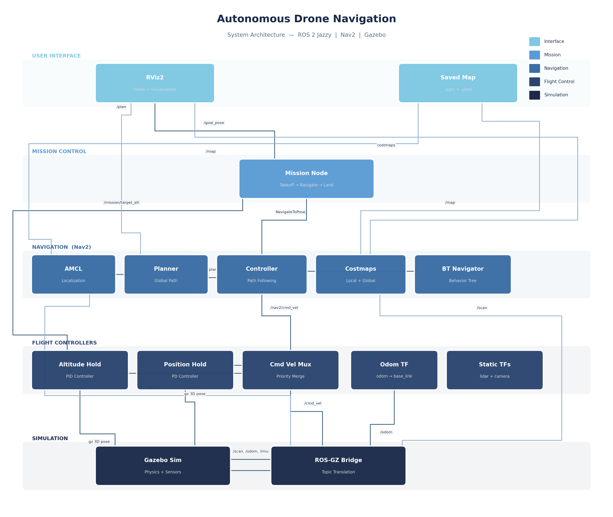

# FlyDuck — Autonomous Drone Navigation — ROS 2 Jazzy + Gazebo

A fully autonomous quadcopter navigation system built on ROS 2 Jazzy. The drone performs SLAM-based mapping, localizes within saved maps using AMCL, and navigates to user-defined goals through the Nav2 stack — with custom altitude and position hold controllers managing stable flight throughout the mission.

## Demo
### Mapping


### Navigation


### Mapping


## Overview

The system uses Nav2 for 2D path planning and obstacle avoidance, while custom flight controllers handle altitude and position stability. A velocity multiplexer merges horizontal navigation commands with vertical altitude corrections, and a mission node orchestrates the full takeoff → navigate → land cycle.

```
RViz Goal → Mission Node → Takeoff → Nav2 (2D path following) → Landing
                              ↕                    ↕
                      Altitude Hold PID      Position Hold PD
                              ↕                    ↕
                        Cmd Vel Mux ──────→ Gazebo Drone
```
## System Architecture



## Features

- **SLAM mapping** via `slam_toolbox` — fly the drone to build an occupancy grid
- **Autonomous navigation** using Nav2 with AMCL localization
- **Altitude hold** — PID controller reading real Gazebo 3D pose data
- **Position hold** — PD controller that locks X/Y when idle, preventing drift
- **Velocity multiplexer** — priority-based merging of navigation, altitude hold, and position hold commands
- **Mission sequencing** — automatic takeoff → fly to goal → land cycle
- **Omni-directional motion model** — AMCL configured for unconstrained drone movement

## Prerequisites

- ROS 2 Jazzy
- Gazebo Harmonic (or compatible `gz-sim`)
- Nav2, SLAM Toolbox, `ros_gz_bridge`, `teleop_twist_keyboard`

```bash
sudo apt install ros-jazzy-navigation2 ros-jazzy-nav2-bringup \
                 ros-jazzy-slam-toolbox ros-jazzy-ros-gz-bridge \
                 ros-jazzy-teleop-twist-keyboard
```

## Build

```bash
mkdir -p ~/flyduck_ws/src
cd ~/flyduck_ws/src
git clone https://github.com/itsOsamasaid/autonomous-drone-ros2.git
cd ~/flyduck_ws
colcon build --packages-select drone_navigation
source install/setup.bash
```

## Usage

### Mapping

Launch the simulation with SLAM, fly the drone around to build a map, then save it.

```bash
# Terminal 1 — simulation + SLAM
ros2 launch drone_navigation simulation.launch.py

# Terminal 2 — Open Rviz2
rviz2

# Terminal 3 — manual flight
ros2 run teleop_twist_keyboard teleop_twist_keyboard --ros-args -r cmd_vel:=/nav2/cmd_vel

# Terminal 4 — save map when complete
ros2 run nav2_map_server map_saver_cli -f ~/flyduck_ws/src/drone_navigation/maps/map
```

After saving, rebuild to install the updated map:

```bash
colcon build --packages-select drone_navigation
```

### Navigation

```bash
ros2 launch drone_navigation navigation.launch.py
```

RViz opens automatically with preconfigured displays. Wait ~25 seconds for all Nav2 nodes to activate, then use **2D Nav Goal** to send the drone to a target. The drone takes off, flies the planned path, and lands at the destination.

## Package Structure

```
drone_navigation/
├── config/
│   ├── nav2.yaml            # Nav2 parameters (AMCL, controller, planner, costmaps)
│   ├── slam.yaml             # SLAM Toolbox configuration
│   └── behavior.xml          # Nav2 behavior tree
├── drone_navigation/
│   ├── altitude_hold_node.py # PID altitude controller (reads Gazebo 3D pose)
│   ├── position_hold_node.py # PD position controller (prevents XY drift)
│   ├── cmd_vel_mux_node.py   # Priority-based velocity multiplexer
│   ├── odom_tf_node.py       # Publishes odom→base_link TF (Z flattened for 2D planning)
│   ├── mission_node.py       # Takeoff → navigate → land state machine
│   └── takeoff_node.py       # Standalone takeoff sequence (simulation mode)
├── launch/
│   ├── navigation.launch.py  # Full navigation stack with RViz
│   └── simulation.launch.py  # Gazebo + SLAM for mapping
├── maps/                     # Saved occupancy grid (.pgm + .yaml)
├── models/mini_drone/        # SDF drone model with multicopter plugins
├── rviz/                     # Preconfigured RViz displays
└── worlds/simple_world.sdf   # Gazebo environment with walls and obstacles
```


